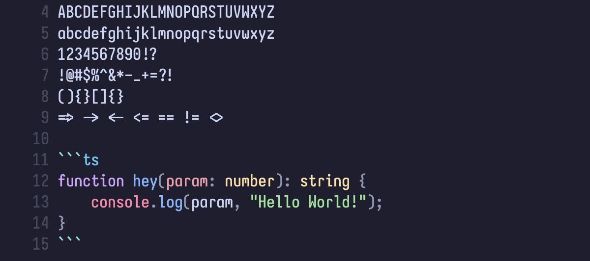

This is a custom build plan for [Iosevka](https://github.com/be5invis/Iosevka)

## How to build?

To build the Iosevka fonts from source, follow the instructions here: https://github.com/be5invis/Iosevka/blob/main/doc/custom-build.md

After building the font, I patch them with Nerd Font using Docker (run at the root of the Iosevka repo):
```bash
docker run --rm -v ./dist/IosevkaCustom/TTF:/in:Z -v ./dist/IosevkaCustom/TTF-NERD:/out:Z -e "PN=10" nerdfonts/patcher 
```
